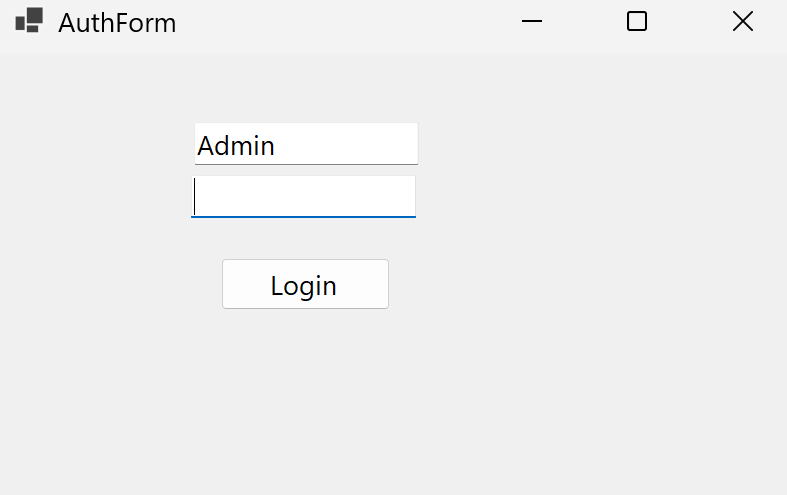
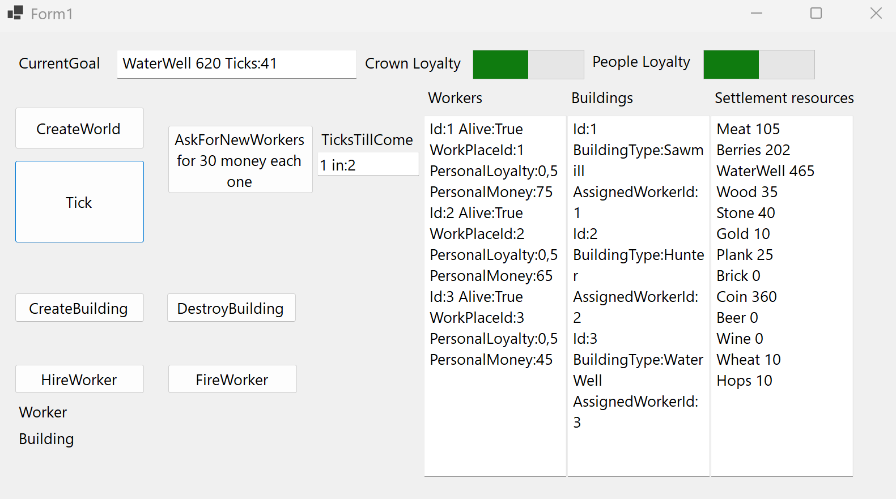

# SettlementGame

A client-server simulation of a colony / worker-camp management system
built with C# and .NET.

The player manages workers, buildings, resources and loyalty while
the simulation progresses through game ticks.

## Technologies

- C#
- .NET 10
- ASP.NET Core Web API
- Windows Forms
- Entity Framework Core
- SQLite
- JWT Bearer Authentication
- BCrypt
- REST API
- Dependency Injection
- Swagger / OpenAPI

## Screenshots




## Features

- Colony / worker-camp simulation based on game ticks
- Worker management
- Building construction and destruction
- Hiring and firing workers
- Ordering new workers
- Resource management
- Population loyalty and Crown loyalty
- Crown tasks
- Win / loss conditions

## Architecture

The solution is divided into three main projects.

### SettlementGame.Domain

Contains the core simulation logic and domain models.

This layer includes the main game services, entities, DTOs and
simulation rules.

### SettlementGame.Web

ASP.NET Core Web API providing the application backend.

It is responsible for:

- REST API endpoints
- authentication and authorization
- database access
- communication with the domain layer

### WinForms Client

A Windows Forms client communicating with the Web API
using HTTP and JSON.

The client does not directly manipulate the server-side game state.
Game operations are performed through the API.

## Data Persistence

The application uses SQLite with Entity Framework Core.

The current simulation state is represented by `DataWorld` in memory.
Game entities are also persisted in SQLite through Entity Framework Core.

When the simulation changes, the corresponding entity data is
updated and saved to the database.

This provides both:

- fast in-memory access during simulation;
- persistent storage in SQLite.

The database is therefore not just used for authentication —
game data is also persisted there.

## Authentication & Authorization

The application uses JWT Bearer Authentication.

Users are stored in SQLite and passwords are stored as BCrypt hashes.

Two roles are currently supported:

- `User`
- `Admin`

The user's role is stored in the database and added to the JWT
as a role claim.

ASP.NET Core authorization is then used to protect API endpoints.

For example:

```csharp
[Authorize]

requires an authenticated user.

[Authorize(Roles = "Admin")]

equires the Admin role.

Creating a new simulation world is intentionally restricted
to administrators.

Running the Project
Requirements
Windows
.NET 10 SDK
Visual Studio
1. Start the Web API

Run the SettlementGame.Web project.

The current development configuration uses:

http://localhost:5126

Swagger / OpenAPI is enabled in the Development environment.

2. Start the WinForms Client

Run the WinForms project.

The client connects to:

http://localhost:5126/
3. Log in

The application initializes development users in the SQLite database
when it is created.

Use a configured account to authenticate and start working with
the simulation.

Project Status

The project is currently a working personal project / portfolio
implementation.

The main game loop, REST API, database persistence,
authentication and Windows Forms client are implemented.

Possible future improvements include:

separate persistent worlds for individual users;
automated tests;
improved error handling;
database migrations;
production deployment;
multiplayer support.
Project Goal

The project was created as a practical demonstration of working with
C#, .NET, ASP.NET Core, Entity Framework Core, REST APIs,
JWT authentication, SQLite, Dependency Injection and Windows Forms.